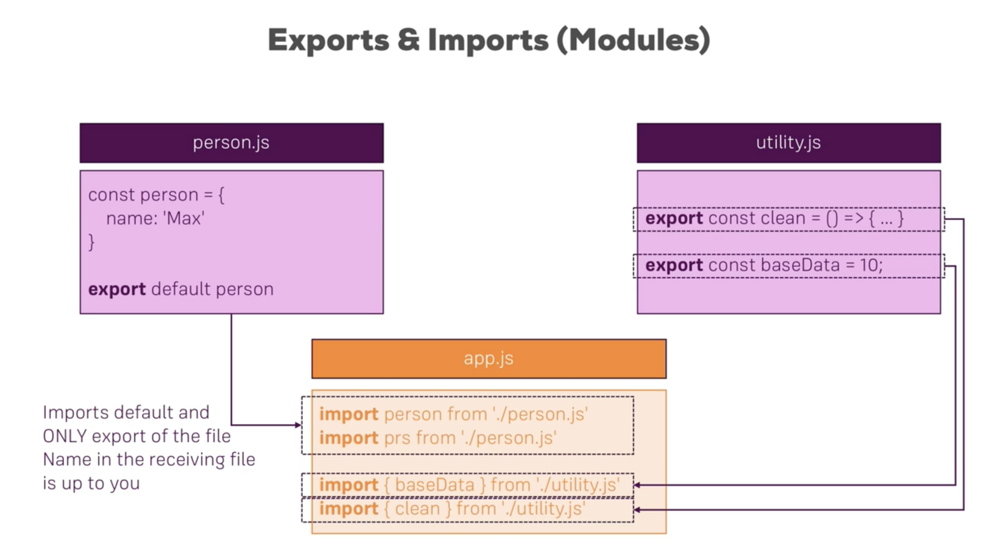
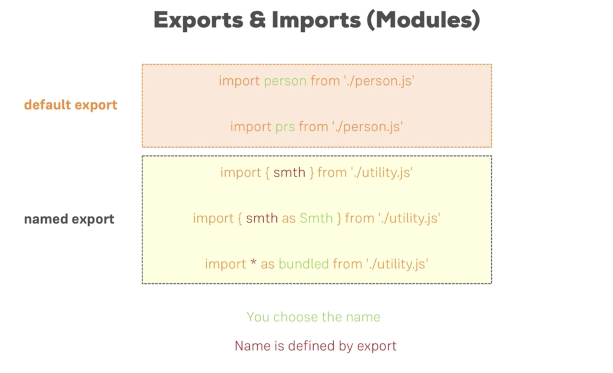

# ES6, ES7 - Next Generation JavaScript
## `let` and `const`
Variables that are constant throughout the application -> declare with `const`
Variable that really is a variable -> `let`

## Arrow functions
Normal function:
```
function someFunction() {
	...
}
```

Arrow function:
```
const someFunction = () => {
	...
}
```

Advantage: Fewer issues with `this`.

Example:
```
function printHello(name) {
	console.log("Hello" + name);
}
```

```
const printHello = name => { // No paranthesis for exactly one argument
	console.log("Hello" + name);
}
```

```
function doubleNum(num) {
	return num * 2;
}
```

```
const doubleNum = num => num * 2; // No braces, return automatically appended for *exactly* one statement
```

## Imports and Exports





## Classes and Inheritance
```
class dummy {
		name = "dummy";
		callMe = () => {
			...
		}
}
```

```
class Speak {
    constructor() {
        this.language = "Spanish";
        this.randomName = "Random Spanish guy";
    }
    sayMyName() {
        console.log("Hola" + this.randomName);
    }
}
class Greeting extends Speak{
    constructor() {
        super();
        this.name = "Random guy";
        this.language = "French";
    }
    greet() {
        console.log("Hello" + this.name);
    }
}

const randomPerson = new Greeting();
randomPerson.greet();
randomPerson.speak();

```

ES7 - no need for constructors

```
class Speak {
    language = "Spanish";
    randomName = "Random Spanish guy";

    sayMyName = () => {
        console.log("Hola" + this.randomName);
    }
}
class Greeting extends Speak{

    name = "Random guy";
    language = "French";

    greet = () => {
        console.log("Hello" + this.name);
    }
}

const randomPerson = new Greeting();
randomPerson.greet();
randomPerson.speak();

```


## Spread and Rest Operator (…)
Spread - Split up array elements or object properties
```
	const newArray = [...oldArray, 1, 2]
	const newObj = {
		...oldObj,
		newProp: 5;
	}
```

Rest - Merge a list of function arguments into an array
```
	function sortNumbers(...numbers) {
		return numbers.sort();
	}
```

### Destructuring

Extract array elements or object properties and store them in variables.

```
const numbers = [1, 2, 3]
[num1, , num3] = numbers;
console.log(num1, num3); //1, 3
```

### Reference types

```
const originalObj = {
 	prop: 'blah'
};

const newObj =  originalObj; //Contains a reference to OriginalObj
const anotherNewObj = { ...originalObj }; //Contains only a copy of originalObj
```

## Array function - map()
Applies a given function on each and every element of a passed array.
```
const numbers = [1, 5, 7];

const doubleEverything = numbers.map((num) => {
    return num * 2;
});

```
