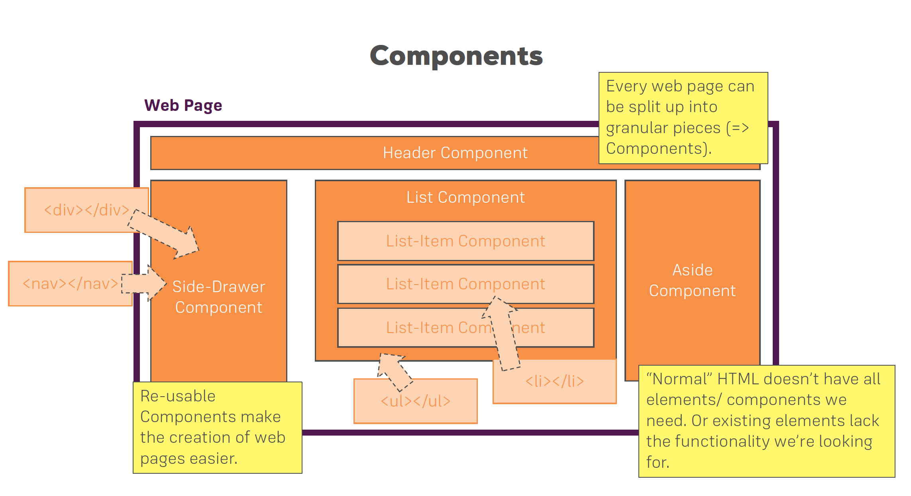
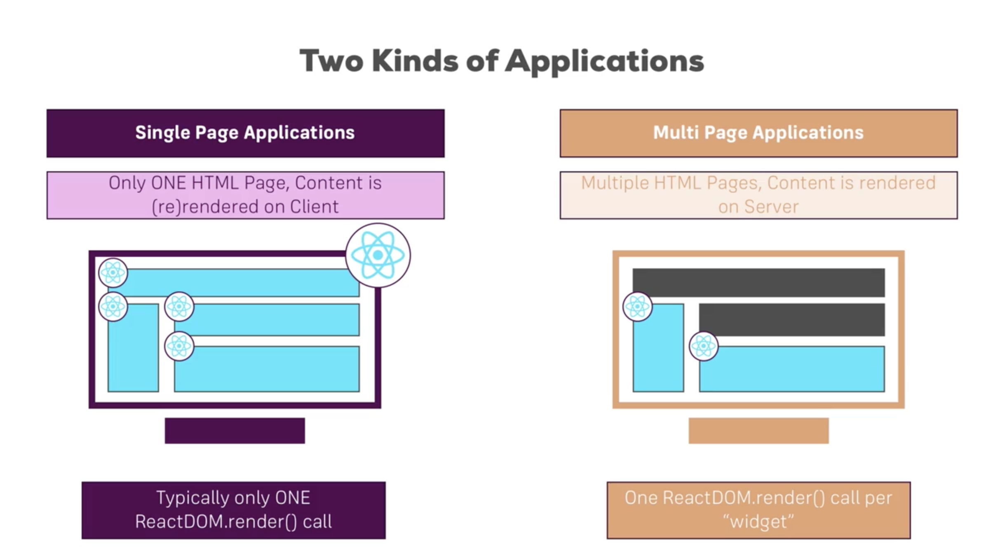

# Introduction to React
## What?
> "A JavaScript library for building user interfaces" - [React](https://reactjs.org/)  

* Javascript driven apps that run in the browsers(not in the server). Things run instantly, no waiting for server response to render something new.
* User interfaces - what users see, _components_ that users see. React uses components to build up websites.

## How?
### Components - Heart and soul of React

* We won’t need to build an entire webpage as a whole. Webpages are made up of multiple parts like a header, footer, sidebar, etc. Each one of these is essentially a component, so we modularise and write the components individually. This also allows us to reuse these components later. Components are basically custom HTML elements.

## Why?
Contained pieces of code.
Easier to change modularised code instead of going and searching in a large codebase for a tiny piece of code.
Advantage? Maintainable, manageable and reusable pieces of code.
No need to repeat code
* UI state becomes difficult to manage with Vanilla JS (Dynamically adding and removing components,  traversing the DOM in a complex application, etc.)
* Allows us to focus on our business logic, not on preventing your app from exploding
* Active community,  Huge ecosystem, high performance
React web apps: The React website

## SPA vs MPA

