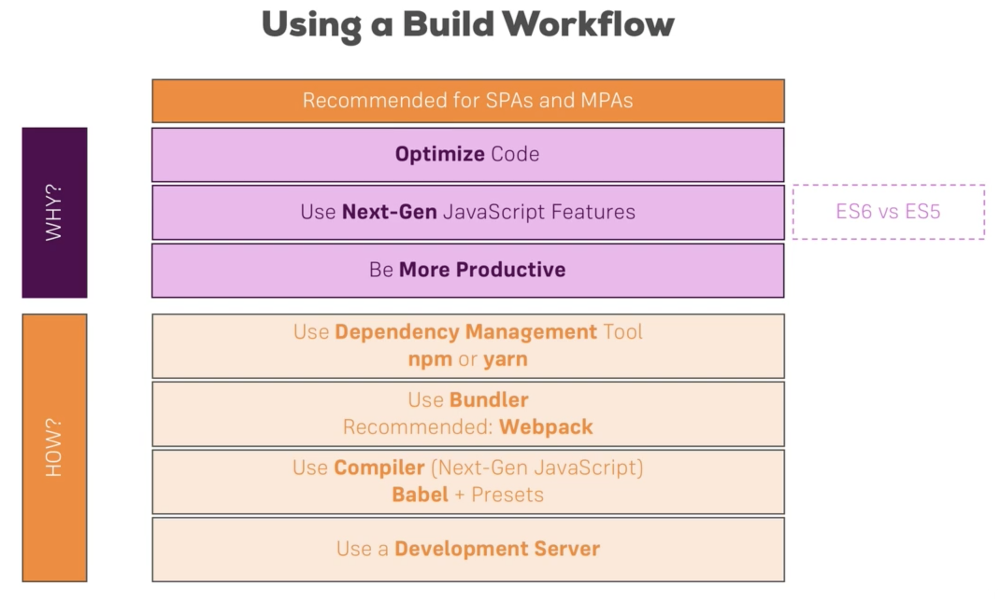

# Setup, Base Features and Syntax
## Build workflow

## Setting up your React environment
Pre-requisites:
* Node - 6.11 (or higher with LTS)
* npm

Follow the steps in [create-react-app](https://github.com/facebook/create-react-app) to setup your React project.
`npm install -g create-react-app`
`create-react-app my-first-react-project`
`cd my-first-react-project`
`npm start`
#react
